# VSCode 中使用 Codex 教程：CC Switch 接入鱼鱼连线中转站 YYLX.IO

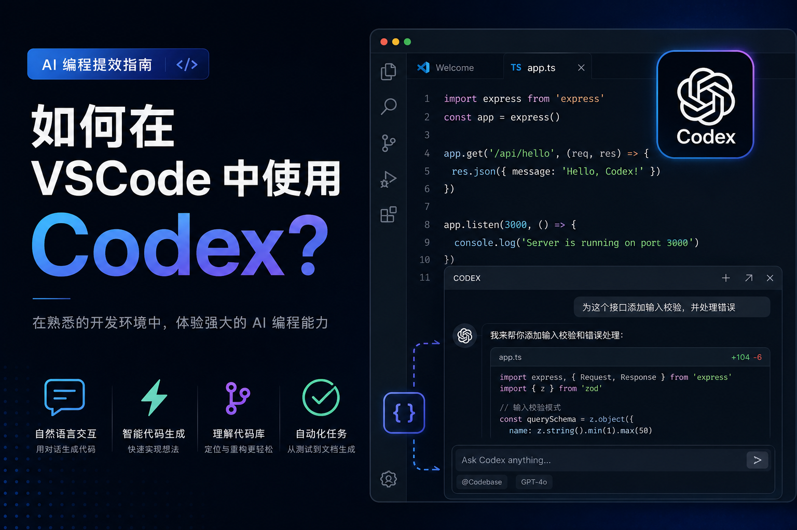

这是一篇面向中文用户的 **VSCode 使用 Codex 教程**。内容会一步步演示：如何在 Visual Studio Code 中安装 Codex 插件，如何下载安装 CC Switch，如何在 [YYLX.IO 鱼鱼连线](https://yylx.io) 创建 GPT Codex 标准分组 API 密钥，如何一键导入 CC Switch，并最终在 VSCode 里验证 Codex 是否可用。

完整博客原文：  
[VSCode 中使用 Codex 教程：CC Switch 接入鱼鱼连线中转站 YYLX.IO](https://yylx.io/blog/vscode-codex-cc-switch-yylx-guide/)

推荐中转站：  
[YYLX.IO 鱼鱼连线](https://yylx.io)

## 适合谁看

如果你想在 VSCode 里直接使用 Codex，但遇到官方账号、API Key、Base URL、模型路由、网络访问或工具配置问题，这篇教程适合你。

按本文走完以后，你应该可以完成这些事：

- 在 VSCode 中安装 Codex 插件；
- 下载并安装 CC Switch；
- 在 YYLX.IO 创建 GPT Codex 标准分组 API 密钥；
- 把 YYLX.IO 配置导入 CC Switch；
- 在 CC Switch 中启用鱼鱼连线线路；
- 重启 VSCode，并在编辑器里直接使用 Codex。

## 准备工作

开始前需要准备：

- Visual Studio Code。如果还没安装，可以去 [VSCode 官网下载](https://code.visualstudio.com/download)。
- CC Switch，用来管理 Codex 相关配置。
- 一个 [YYLX.IO 鱼鱼连线](https://yylx.io) 账号。
- 能访问 VSCode 插件市场、GitHub Releases 和 YYLX.IO 的网络环境。

下面所有图片都存放在本仓库的 `images/` 目录下，不依赖 WordPress 外链，方便 GitHub README 直接展示。

## 第一步：安装 VSCode 和 Codex 插件

打开 VSCode，进入左侧 Extensions 插件页面，在搜索框里输入 **Codex**。找到 Codex 插件后点击安装。

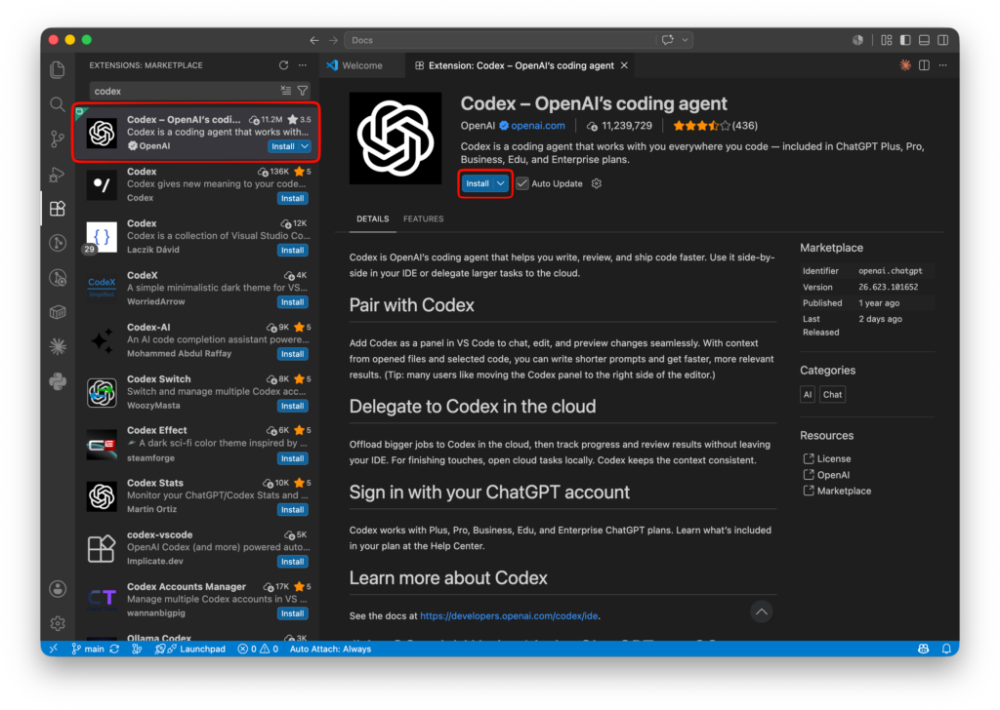

安装完成后，点击 VSCode 右上角的 Codex 图标，就可以打开 Codex 插件主界面。

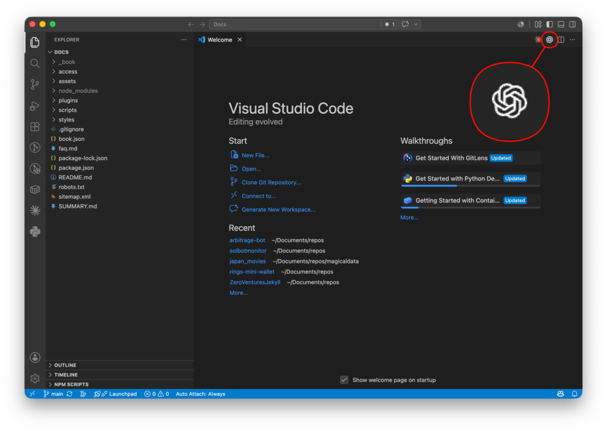

这时插件可能显示未登录或不可用状态。先不用点任何登录按钮，也不用在这里手动乱填配置。后面会通过 CC Switch 把 YYLX.IO 的配置导入进去。

## 第二步：下载并安装 CC Switch

打开 CC Switch 的 GitHub Releases 页面：

[https://github.com/farion1231/cc-switch/releases](https://github.com/farion1231/cc-switch/releases)

进入页面后，在左侧选择最新版本。

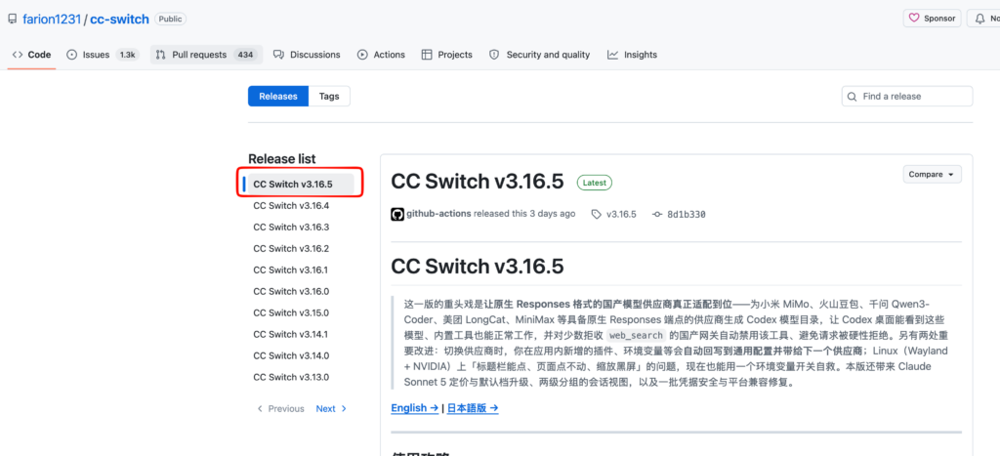

向下滚动到 **Assets** 区域，选择适合自己系统的安装包。macOS、Windows、Linux 的文件名通常不同，按自己的系统下载即可。

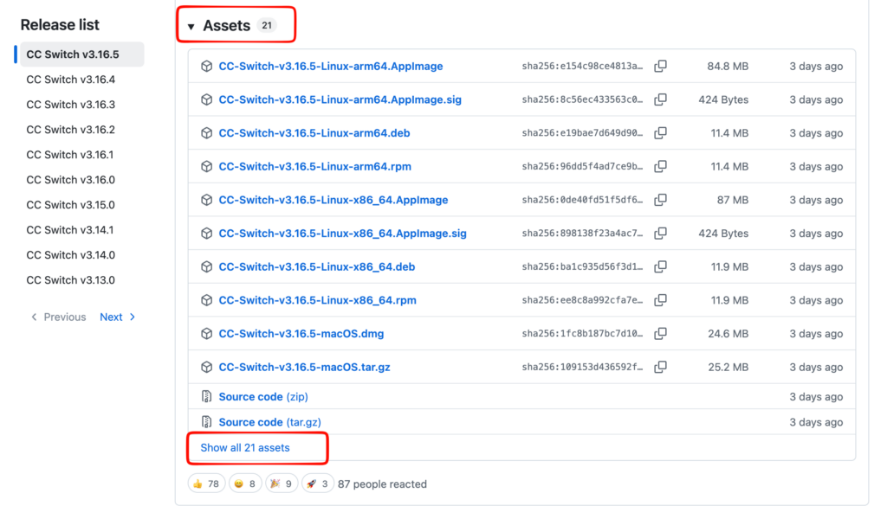

如果默认列表里没有看到你的系统版本，可以点击 **Show all** 展开全部文件。

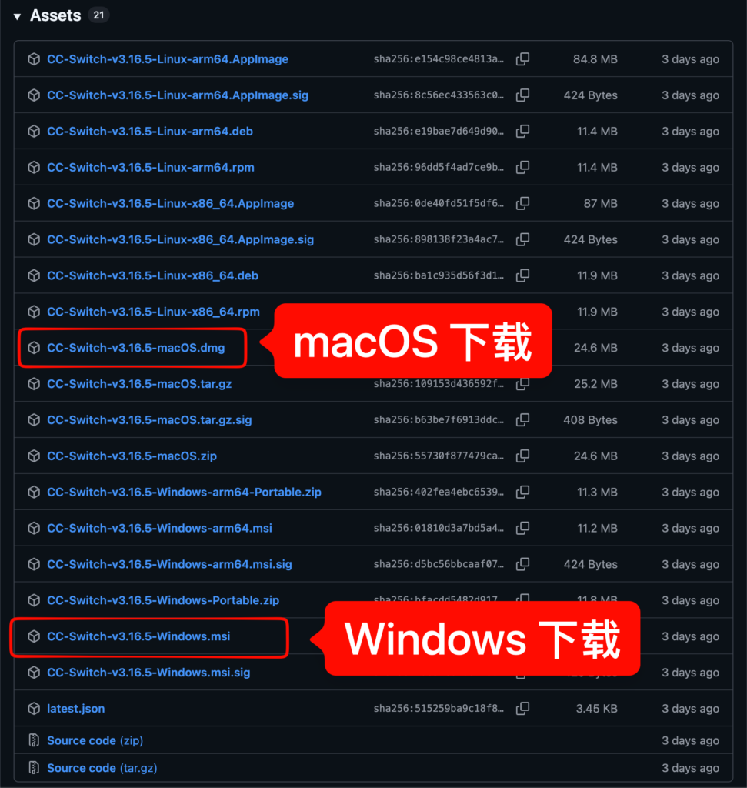

下载后按系统提示正常安装并打开 CC Switch。打开以后先放在这里，不需要手动创建供应商配置，后面会从 YYLX.IO 一键导入。

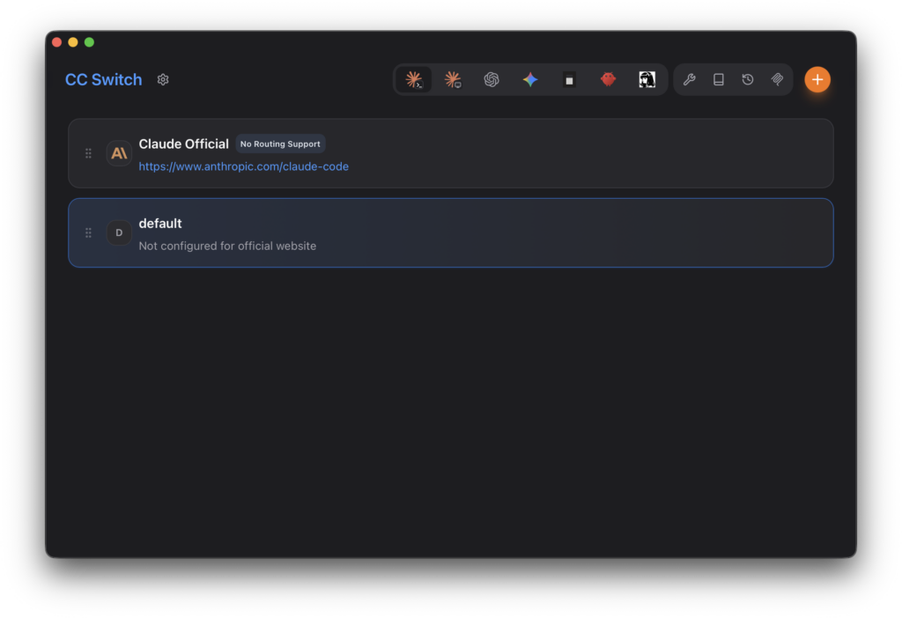

## 第三步：在 YYLX.IO 创建 GPT Codex 密钥

打开 [YYLX.IO 鱼鱼连线](https://yylx.io)，注册并登录账号。进入后台后，点击 **API 密钥**，再点击 **创建密钥**。

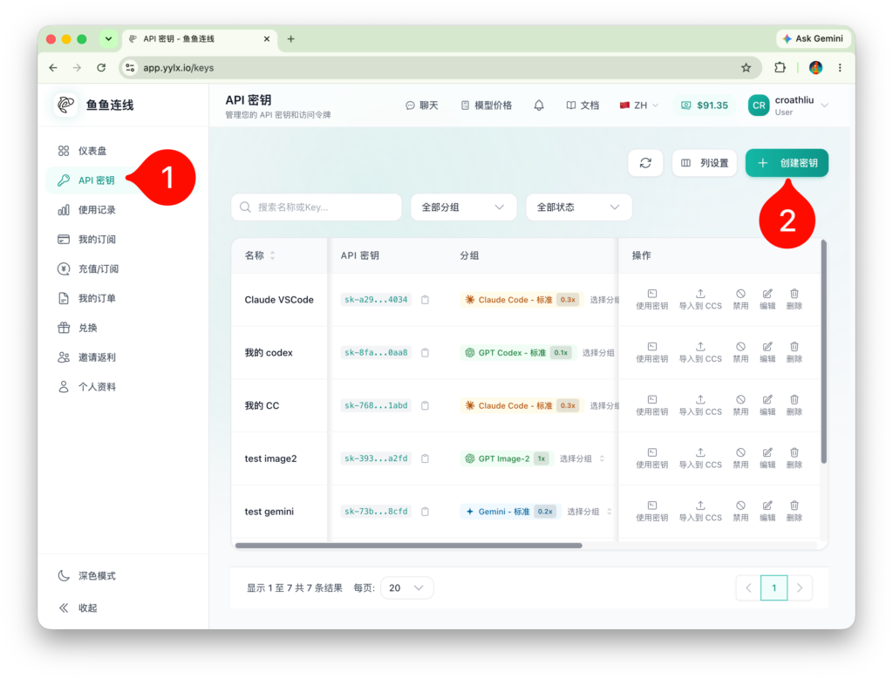

创建密钥时，分组选择 **GPT Codex 标准分组**。这个分组会决定后续 Codex 请求走哪套模型和路由。

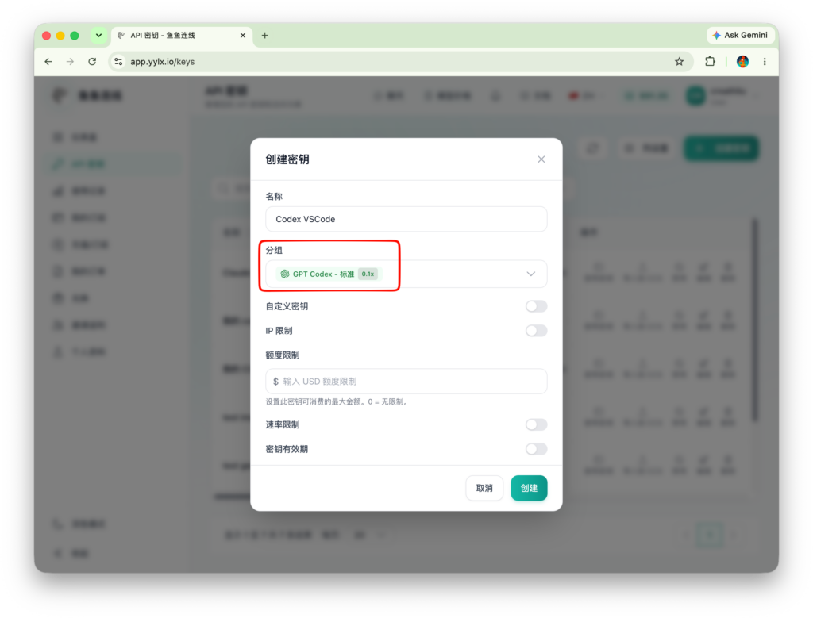

创建完成后回到 API 密钥列表。找到刚创建的密钥，点击 **导入 CCS**。这里的 CCS 指的是导入到 CC Switch 的配置。

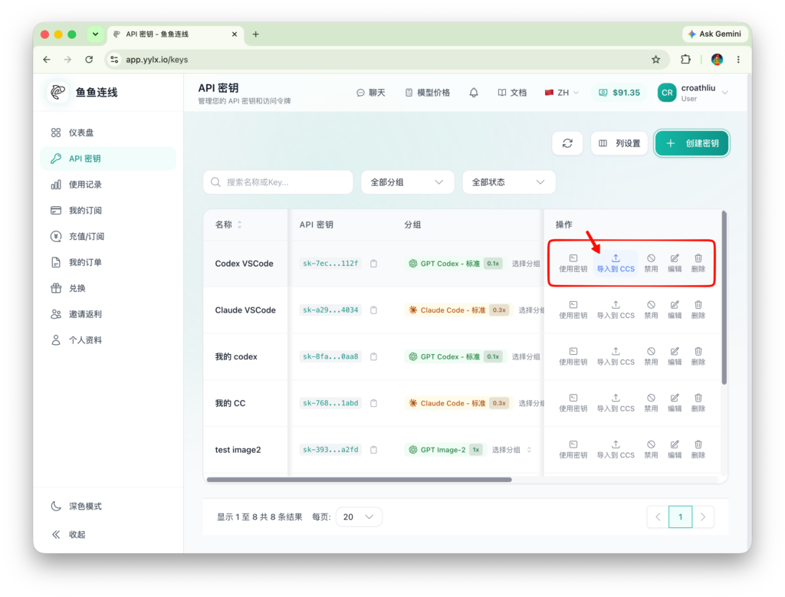

浏览器会弹出是否打开 CC Switch 的提示，点击 **打开 CC Switch**。

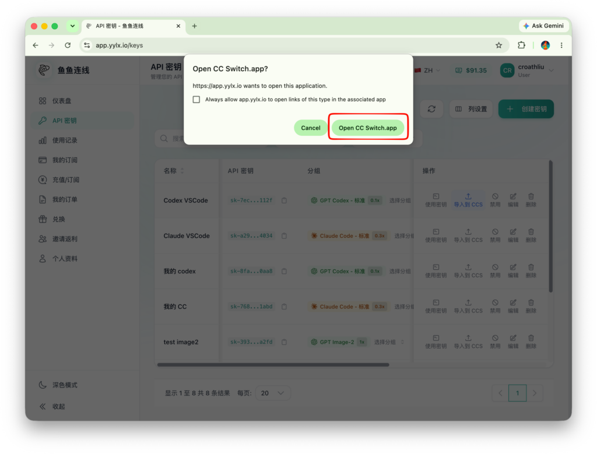

## 第四步：导入并启用 CC Switch 配置

CC Switch 被唤起后，会显示导入确认窗口。确认信息无误后点击 **导入**。

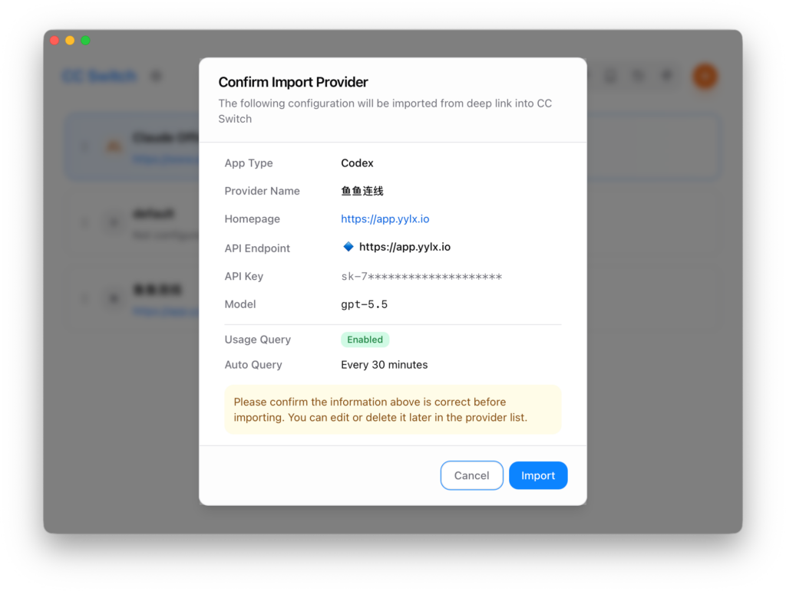

导入完成后，在新出现的鱼鱼连线配置这一行点击 **Enable**。只有启用后，Codex 才会实际使用这条线路。

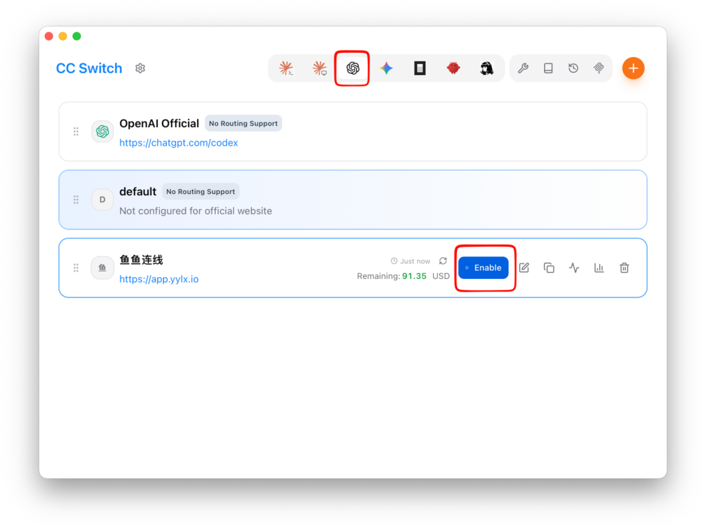

如果 CC Switch 里已经出现鱼鱼连线配置，并且状态已经启用，就说明 API Key、Base URL 和供应商配置已经进入 CC Switch。这个路径下不需要再手动复制一堆环境变量。

## 第五步：重启 VSCode 并验证 Codex

启用配置后，关闭并重新打开 VSCode。再次打开 Codex 插件，如果已经能看到对话框，就说明插件读到了当前配置。

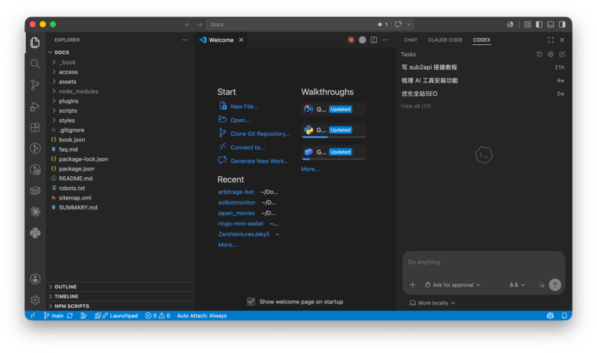

建议先发一句简单测试，比如“请用一句话介绍你能做什么”。如果能正常回复，说明 VSCode 插件、CC Switch 和 YYLX.IO 密钥已经串起来了。

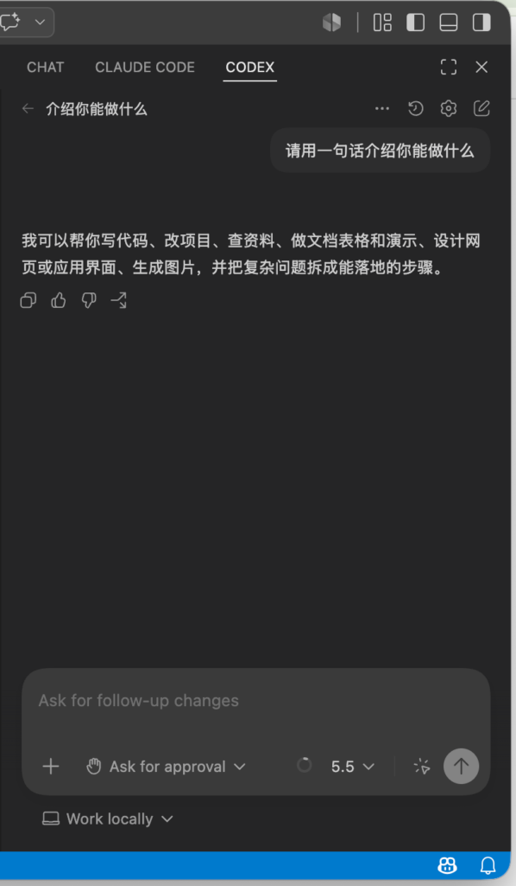

到这里，VSCode 中使用 Codex 的基础配置就完成了。后续你可以在真实项目里让 Codex 解释代码、生成单元测试、定位报错，或者辅助修改文件。

## 常见问题

如果 VSCode 里还是未登录状态，先确认 CC Switch 中鱼鱼连线这一行是否已经 Enable。很多时候不是插件问题，而是当前线路没有启用。

如果点击“导入 CCS”以后没有反应，检查浏览器是否拦截了“打开外部应用”的弹窗，也可以确认 CC Switch 是否已经安装并能正常启动。

如果 Codex 插件能打开但无法回复，建议按顺序检查：

- YYLX.IO API 密钥是否创建在 **GPT Codex 标准分组**；
- 账号余额是否可用；
- CC Switch 当前启用的是不是刚导入的鱼鱼连线配置；
- 是否还有其他 Codex CLI、OpenAI-compatible 工具或环境变量覆盖了当前配置。

## 为什么要用 AI Router / 中转站

很多人卡住的地方不是安装 VSCode 插件，而是官方账号、API Key、Base URL、模型路由、网络访问和多工具配置。

使用 **CC Switch + YYLX.IO 鱼鱼连线** 的好处是：

- VSCode 继续作为主力编辑器；
- Codex 直接在编辑器里使用；
- CC Switch 负责管理当前线路；
- YYLX.IO 提供 GPT Codex API 密钥和模型分组；
- 换机器、换工具时更容易复用同一套配置。

## 相关链接

- 完整中文博客：[VSCode 中使用 Codex 教程](https://yylx.io/blog/vscode-codex-cc-switch-yylx-guide/)
- AI 中转站 / API 网关：[YYLX.IO 鱼鱼连线](https://yylx.io)
- VSCode 下载：[https://code.visualstudio.com/download](https://code.visualstudio.com/download)
- CC Switch Releases：[https://github.com/farion1231/cc-switch/releases](https://github.com/farion1231/cc-switch/releases)

## 相关关键词

VSCode 使用 Codex、VSCode Codex 教程、Codex 中转站、Codex AI Router、Codex API Gateway、CC Switch Codex、鱼鱼连线、YYLX.IO、GPT Codex 标准分组、OpenAI-compatible AI coding tools、use Codex in VSCode、Codex VSCode setup。
